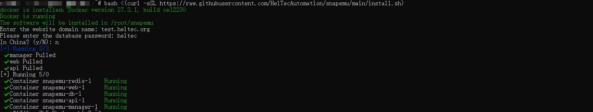

# Cloud Server Deployment SnapEmu

**Users can deploy Snapemu based on their own servers to improve data security.**

After the user logs in to their server account, use this command to install Snapemu.

```
bash <(curl -sSL https://raw.githubusercontent.com/HelTecAutomation/snapemu/main/install.sh)
```



- The domain name here can be freely filled in, and the web pages logged in afterwards are only related to the user's server address.
- The password for entering the database can be freely set. Please note that if you download again, it needs to be the same as the password for this database.

After successful download, log in to the server address webpage and Snapemu deployment will be successful, as shown in the figure.

