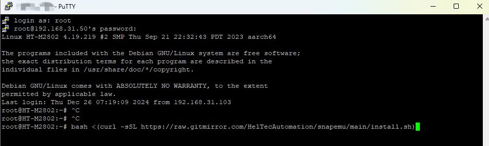
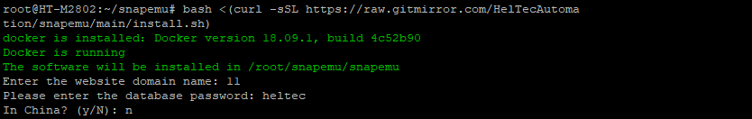
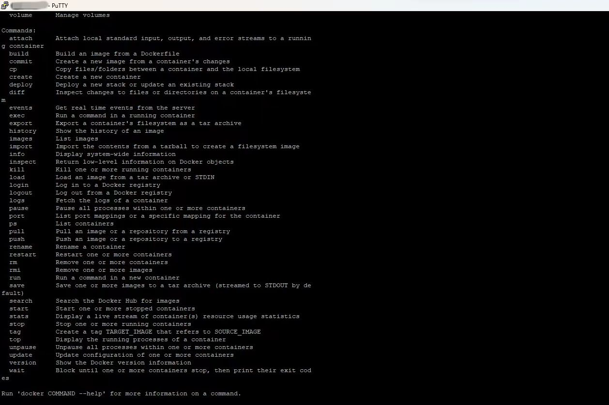
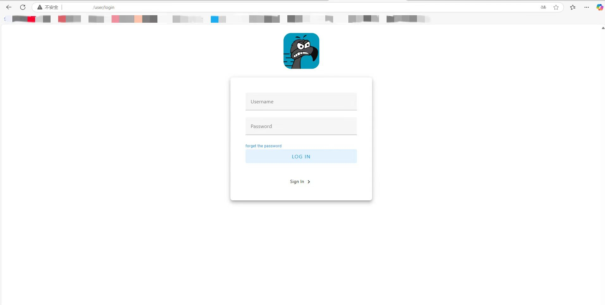

# HT-M2802 Local Deployment SnapEmu

After successfully configuring the HT-M2802 gateway according to [this document](https://docs.heltec.cn/en/gateway/ht-m2802/quick_start.html#connect-to-the-network-using-eth), use SSH to connect.



After successful connection, use this command to download SnapEmu.

```
bash <(curl -sSL https://raw.gitmirror.com/HelTecAutomation/snapemu/main/install.sh)
```



- The domain name here can be freely filled in, and the web pages accessed afterwards are only related to the SSH address. 

- The password for entering the database can be freely set. Please note that if you download again, it needs to be the same as the password for this database

If you encounter such a problem, simply use this command `docker-compose up -d` to update Docker. If not, please skip.



After successful download, log in to the SSH hotspot address webpage and Snapemu deployment will be successful, as shown in the figure.

