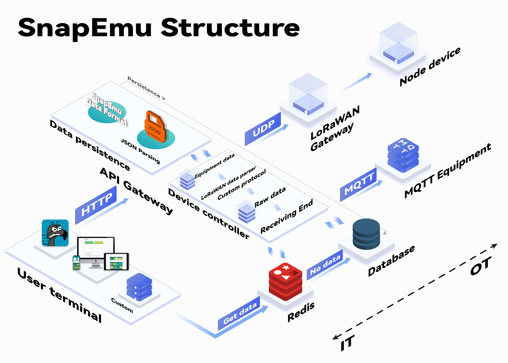

Build a LoRaWAN System with SnapEmu
===================================

Resource guidance stickers
--------------------------

Building a LoRaWAN system aims to utilize Heltec LoRa devices to
achieve low-power, long-distance, low data rate wireless communication,
especially in IoT application scenarios. Read data using Heltec LoRa
nodes and upload it through the LoRaWAN gateway, and finally display its
data and curves on our cloud platform SnapEmu.

1. Summary
----------

This document is a comprehensive guidance document aims at explaining
how to quickly build a LoRaWAN network. To build a LoRaWAN communication
system must need these three parts:

- **A LoRaWAN server:** LoRaWAN server include two parts, Network Server
  and Application Server (We also generally call them NS). All
  operations will be based on SnapEmu.

- **A LoRa Gateway:** A specialized device for LoRaWAN packet
  Uplink/Downlink forwarder. You can recognize it as a bridge between
  LoRa Node devices and LoRa NS.

- **A LoRa Node device:** Usually it’s sensors or actuators are used to
  collect data or control some devices.

2. preparation
--------------

**Heltec LoRaWAN server -** `Snapemu <https://platform.snapemu.com/dashboard/>`__

**Heltec LoRa Gateway -** `Several optional
gateways <https://heltec.org/product-category/lora/lora-gateway>`__

+-----------------------------------+-----------------------------------+
| Heltec Gateway                    | Feature                           |
+===================================+===================================+
| `HT-M02 Edge LoRa Gateway         | The edge computing LoRa gateway   |
| (V2) <https://                    | integrated with Wi-Fi, PoE and    |
| heltec.org/project/ht-m02-v2/>`__ | LTE functions                     |
+-----------------------------------+-----------------------------------+
| `HT-M2802 Indoor LoRa             | Having high-performance hotspots  |
| Gateway <https:/                  |                                   |
| /heltec.org/project/ht-m2802/>`__ |                                   |
+-----------------------------------+-----------------------------------+
| `HT-M2808 Indoor Hotspot For      | Full LoRaWAN/LongFi gateway       |
| Helium <https:/                   | support Helium network            |
| /heltec.org/project/ht-m2808/>`__ |                                   |
+-----------------------------------+-----------------------------------+
| `HT-M01S Indoor LoRa Gateway      | A standard LoRaWAN gateway based  |
| (Rev.2.0) <https://h              | on ESP32 MCU                      |
| eltec.org/project/ht-m01s-v2/>`__ |                                   |
+-----------------------------------+-----------------------------------+
| `HT-M7603 Indoor LoRa             | A cost-effective eight-channel    |
| Gateway <https:/                  | indoor LoRa gateway               |
| /heltec.org/project/ht-m7603/>`__ |                                   |
+-----------------------------------+-----------------------------------+
| `HT1303 LoRaWAN Concentrator      | LoRa gateway module based on      |
| Module <https                     | SX1303+SX1250 chipset             |
| ://heltec.org/project/ht1303/>`__ |                                   |
+-----------------------------------+-----------------------------------+
| `HT-H7608 Wi-Fi HaLow Router /    | Used for long-distance/high-speed |
| Gateway <https:/                  | data transmission                 |
| /heltec.org/project/ht-h7608/>`__ |                                   |
+-----------------------------------+-----------------------------------+

**Heltec LoRa Node device -** `ESP32 + LoRa
Series <https://heltec.org/product-category/lora/lrnode/page/2/>`__,
`nRF52840 + LoRa Series <https://heltec.org/project/mesh-node-t114/>`__,
`Cubcell Series <https://heltec.org/shop-default/page/2/>`__ and `WiFi
HaLow Series <https://heltec.org/product-category/halow/>`__

+-----------------------------------+-----------------------------------+
| Heltec LoRa Node                  | Feature                           |
+===================================+===================================+
| **Plug & Play**                   |                                   |
+-----------------------------------+-----------------------------------+
| `Heltec Capsule Sensor            | A portable LoRa/LoRaWAN device    |
| V3 <https://heltec.org/proj       | based on ESP32-S3 and SX1262      |
| ect/heltec-capsule-sensor-v3/>`__ |                                   |
+-----------------------------------+-----------------------------------+
| `HRU-3601 <https:/                | A low cost indoor LoRa t&h        |
| /heltec.org/project/hru-3601/>`__ | (temperature and humidity)        |
|                                   | monitor                           |
+-----------------------------------+-----------------------------------+
| `Sensor                           | A ready-to-use LoRa/LoRaWAN       |
| Hub <https://h                    | sensor for indoor (industrial)    |
| eltec.org/project/sensor-hub/>`__ | applications                      |
+-----------------------------------+-----------------------------------+
| `Sensor Hub – Bus                 | A sub-model of the Sensor Hub for |
| Transformer <https://heltec.org   | outdoor series that specifically  |
| /project/sensor-hub-hri-3622/>`__ | drives third-party RS-485 sensors |
+-----------------------------------+-----------------------------------+
| `RS485-LoRa Wireless              | HRI-4851 converts 485 bus into    |
| Converter                         | LoRa, HRI-4852 connect HRI-4851   |
| <https://heltec.org/project/r     | to server via ETH or LTE.         |
| s485-lora-wireless-converter/>`__ |                                   |
+-----------------------------------+-----------------------------------+
| `RS485-LoRaWAN Wireless           | A device that converts 485 bus    |
| Converter                         | into LoRa, LTE, and Ethernet      |
| <https://heltec.org/project/rs48  | communication                     |
| 5-lorawan-wireless-converter/>`__ |                                   |
+-----------------------------------+-----------------------------------+
| `RS485-TCP/UDP/MQTT Converter     | HRI-4853 converts RS-485 bus into |
| HRI-4                             | LTE, and Ethernet communication   |
| 853 <https://heltec.org/project/r |                                   |
| s4853-tcp-udp-mqtt-converter/>`__ |                                   |
+-----------------------------------+-----------------------------------+
| `Wireless Aggregator – Bus        | A LoRa/LoRaWAN device for outdoor |
| Transformer <https:/              | applications                      |
| /heltec.org/project/hri-3632/>`__ |                                   |
+-----------------------------------+-----------------------------------+
| `Wireless Aggregator – Sensor     | A LoRa/LoRaWAN device for outdoor |
| Docker <https:/                   | applications                      |
| /heltec.org/project/hri-3631/>`__ |                                   |
+-----------------------------------+-----------------------------------+
| `Wireless Aggregator – Valve      | A LoRaWAN conveter belonging to   |
| Controller <https:/               | Sensor Hub for Outdoor series     |
| /heltec.org/project/hri-3633/>`__ |                                   |
+-----------------------------------+-----------------------------------+
| `Wireless Temperature Measuring   | A rod type wireless thermoprobe   |
| Rod <https://heltec               | integrated with LoRa wireless     |
| .org/project/temperature-rod/>`__ | transmission technology           |
+-----------------------------------+-----------------------------------+
| `Wireless                         | A wireless thermoprobe displaying |
| Thermoprobe <https://heltec.org/  | or uploading temperature via      |
| project/wireless-thermoprobe/>`__ | LoRaWAN                           |
+-----------------------------------+-----------------------------------+
| **Maker series**                  |                                   |
+-----------------------------------+-----------------------------------+
| `WiFi LoRa                        | A classic IoT development board   |
| 32(V3) <https://heltec            |                                   |
| .org/project/wifi-lora-32-v3/>`__ |                                   |
+-----------------------------------+-----------------------------------+
| `Wireless                         | An E-Ink development kit with     |
| Paper <https://helte              | multiple wireless drive methods   |
| c.org/project/wireless-paper/>`__ |                                   |
+-----------------------------------+-----------------------------------+
| `Wireless                         | HTIT-Wsh provides Wi-Fi, BLE, and |
| Shell(V3) <https://heltec.o       | LoRa solutions                    |
| rg/project/wireless-shell-v3/>`__ |                                   |
+-----------------------------------+-----------------------------------+
| `Wireless Stick                   | A development board for Wi-Fi,    |
| Lite(V3) <https://heltec.org/pr   | Bluetooth and LoRa                |
| oject/wireless-stick-lite-v2/>`__ |                                   |
+-----------------------------------+-----------------------------------+
| `Wireless                         | Meet users’ requirements for high |
| Stick(V3) <https://heltec.o       | performance and small size        |
| rg/project/wireless-stick-v3/>`__ |                                   |
+-----------------------------------+-----------------------------------+
| `Wireless                         | A development kit based on        |
| Tracker <https://heltec.          | ESP32-S3FN8                       |
| org/project/wireless-tracker/>`__ |                                   |
+-----------------------------------+-----------------------------------+
| `Vision Master                    | A IoT development board with 2.13 |
| E213 <https://heltec.or           | inch E-Ink                        |
| g/project/vision-master-e213/>`__ |                                   |
+-----------------------------------+-----------------------------------+
| `Vision Master                    | A IoT development board with 2.9  |
| E290 <https://heltec.or           | inch E-Ink                        |
| g/project/vision-master-e290/>`__ |                                   |
+-----------------------------------+-----------------------------------+
| `Vision Master                    | An ESP32+LoRa development board   |
| T190 <https://heltec.or           | with a 1.9-inch TFT               |
| g/project/vision-master-t190/>`__ |                                   |
+-----------------------------------+-----------------------------------+
| `Multi Size E-ink Drive           | E-ink driveboard, the accessory   |
| Board <https://heltec.            | of E-ink display                  |
| org/project/e-ink-driveboard/>`__ |                                   |
+-----------------------------------+-----------------------------------+
| `HT-CT62 <https:                  | A LoRa/LoRaWAN node module with a |
| //heltec.org/project/ht-ct62/>`__ | high sensitivity, and low cost    |
+-----------------------------------+-----------------------------------+
| `HT-AT62 <https:                  | A cost-effective LoRa node module |
| //heltec.org/project/ht-at62/>`__ |                                   |
+-----------------------------------+-----------------------------------+
| `Mesh Node T114                   | A Low Power Consumption           |
| (Rev. 1.0) <https://heltec.org/pr | development board based on        |
| oject/mesh-node-t114-rev-1-0/>`__ | nRF52840 and SX1262               |
+-----------------------------------+-----------------------------------+
| `Mesh Node T114                   | A Low Power Consumption           |
| (Rev. 2.0) <https://helte         | development board based on        |
| c.org/project/mesh-node-t114/>`__ | nRF52840 and SX1262               |
+-----------------------------------+-----------------------------------+
| `Sufficient IoT                   | Linux SiP with 1GHz dual-core ARM |
| Hub <https://heltec.or            | A7 and 128MB DDR3                 |
| g/project/sufficient-iot-hub/>`__ |                                   |
+-----------------------------------+-----------------------------------+
| `Wireless                         | A bridge that converts            |
| Bridge <https://heltec            | WiFi/Bluetooth LoRa signals to    |
| .org/project/wireless-bridge/>`__ | each other                        |
+-----------------------------------+-----------------------------------+
| **CubeCell Series**               |                                   |
+-----------------------------------+-----------------------------------+
| `CubeCell – AB01 Dev-Board        | LoRa development board integrated |
| (V2) <https://hel                 | with MCU                          |
| tec.org/project/htcc-ab01-v2/>`__ |                                   |
+-----------------------------------+-----------------------------------+
| `CubeCell – AM01 Module           | A small volume, stamp hole        |
| (V2) <https://hel                 | package module                    |
| tec.org/project/htcc-am01-v2/>`__ |                                   |
+-----------------------------------+-----------------------------------+
| `CubeCell 1/2AA Node              | A Dev-Board. Friendly designed    |
| (HTCC-AB02A) <https://h           | for developers, easy to verify    |
| eltec.org/project/htcc-ab02a/>`__ | communication solutions           |
+-----------------------------------+-----------------------------------+
| `CubeCell AM02 Module             | A Module, Supports AT transparent |
| Plus <https://                    | transmission commands             |
| heltec.org/project/htcc-am02/>`__ |                                   |
+-----------------------------------+-----------------------------------+
| `CubeCell Dev-Board Plus          | A Dev-Board, based on ASR605x     |
| (HTCC-AB02) <https://             | (ASR6501, ASR6502)                |
| heltec.org/project/htcc-ab02/>`__ |                                   |
+-----------------------------------+-----------------------------------+
| `CubeCell GPS-6502                | A Dev Board with integrated       |
| (HTCC-AB02S) <https://h           | AIR530Z GPS module                |
| eltec.org/project/htcc-ab02s/>`__ |                                   |
+-----------------------------------+-----------------------------------+
| **WiFi HaLow Series**             |                                   |
+-----------------------------------+-----------------------------------+
| `ESP32 Wi-Fi HaLow                | A built-in camera development     |
| Camera <https:                    | board based on ESP32-S3 MCU and   |
| //heltec.org/project/ht-hc32/>`__ | Wi Fi HaLow module                |
+-----------------------------------+-----------------------------------+
| `Raspberry Pi Wi-Fi HaLow Camera  | A Raspberry Pi HAT that           |
| HAT <https:                       | integrates Wi-Fi HaLow module and |
| //heltec.org/project/ht-hr01/>`__ | a 5MP camera                      |
+-----------------------------------+-----------------------------------+

3. Deploy SnapEmu
-----------------

`SnapEmu <https://platform.snapemu.com/dashboard/>`__ **is an open-source IoT platform that
supports LoRaWAN and MQTT, designed to simplify device management, data
decoding, and data visualization operations. It provides intuitive
device registration and data flow monitoring functions, supports low
code visualization of upstream data decoding and downstream instruction
sending, and has corresponding comprehensive documentation support,
enabling developers to quickly deploy and debug**.

.. toctree::
   :maxdepth: 2

   Local Deploy/index

3.1 Register LoRa Gateway on SnapEmu
~~~~~~~~~~~~~~~~~~~~~~~~~~~~~~~~~~~~

Here are four methods for registering gateways on SnapEmu. Select the
corresponding gateway for registration.

**Note:** *The frequency band for configuring the gateway page needs to
be consistent with the frequency band selected on snapemu.*

.. toctree::
   :maxdepth: 2

   Gateway Register on Snapemu/index

3.2 Node Devices Connection
~~~~~~~~~~~~~~~~~~~~~~~~~~~

.. toctree::
   :maxdepth: 2

   Node Devices Connection/index

- WiFi LoRa 32 working with SnapEmu

  - `Hall Sensor Door Detection LoRaWAN System <https://www.hackster.io/ashley15/wifi-lora-32-hall-sensor-door-detection-lorawan-system-57febb>`__

- nRF T114 working with SnapEmu

  - `Ultrasonic Sensor Distance Measurement with
    LoRaWAN <https://www.hackster.io/ashley15/ultrasonic-sensor-distance-measurement-with-lorawan-78c30d>`__

  